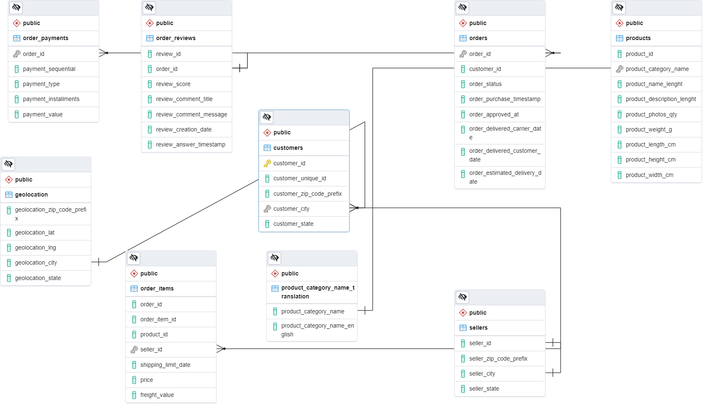
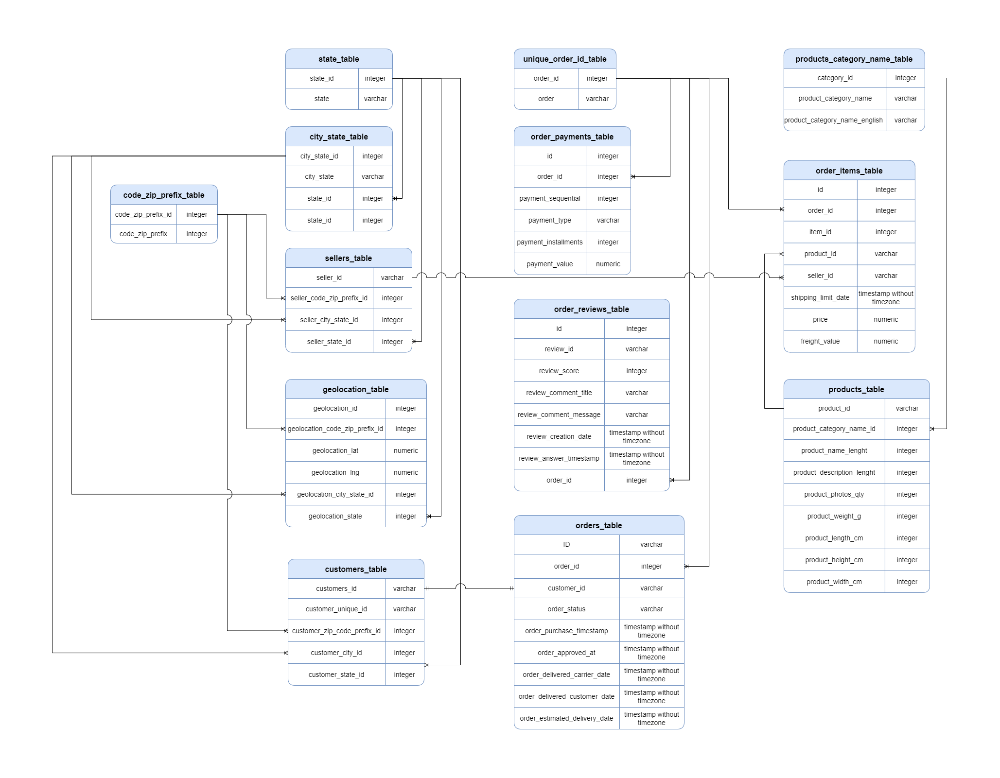
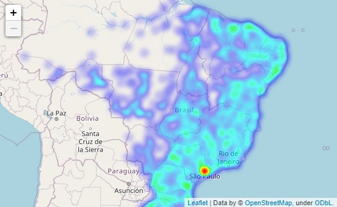
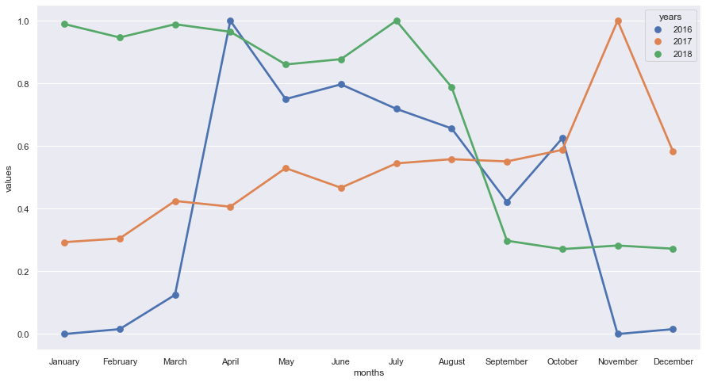

# Monitoring-Brazilian-e-commerce

## Table of Contents

1. [Raw Data](#raw_data)
2. [Exploratory Analysis](#exploratory_analysis)
3. [Transform (Clean/Preprocessing)](#transform)
4. [Load](#load)
5. [Analysis](#analysis)
6. [About](#About)

##  Raw Data

Our initial data consist on 9 CSV files extracted from Kaggle. [You can consult it here.](https://www.kaggle.com/datasets/olistbr/brazilian-ecommerce)

The datasets contain the information of 100,000 orders from 2016 to 2018 made at multiple marketplaces in Brazil.

##  Exploratory Analisis

We perform an exploratory analysis to understand which information we have and obtain the next squeme.

For a more detailed explanation of each dataset you can consult:

- [Customers Dataset](./notebooks/exploratory_analysis/olist_customers_dataset.ipynb)

- [Geolocation Dataset](./notebooks/exploratory_analysis/olist_geolocation_dataset.ipynb)

- [Order Items Dataset](./notebooks/exploratory_analysis//olist_order_items_dataset.ipynb)

- [Order Payments Dataset](./notebooks/exploratory_analysis/olist_order_payments_dataset.ipynb)

- [Order Reviews Dataset](./notebooks/exploratory_analysis/olist_order_reviews_dataset.ipynb)

- [Orders Dataset](./notebooks/exploratory_analysis/olist_orders_dataset.ipynb)

- [Products Dataset](./notebooks/exploratory_analysis/olist_products_dataset.ipynb)

- [Sellers Dataset](./notebooks/exploratory_analysis/olist-sellers-dataset.ipynb)

**Product Category Name Translation** is only a table with product categories translation from portugese to english.

##  Transform (Clean/Preprocessing)

We start to clean data to replacing special portuguese characters like Ç or ã for their ISO basic letters.

| From | to  |
| ---- | --- |
| Ç    | C   |
| ã    | a   |

Also we remove emojis, and punctuation marks (",", "-").

To see a detailed description of this process you can consult:

- [Zip Code](./notebooks/preprocessing_data/code_zip_prefix_update.ipynb)

- [Customer Dataset](./notebooks/preprocessing_data/customers_dataset.ipynb)

- [Geolocation Dataset](./notebooks/preprocessing_data/geolocation_dataset.ipynb)

- [Items Dataset](./notebooks/preprocessing_data/order_items_dataset.ipynb)

- [Payments Dataset](./notebooks/preprocessing_data/order_payments_dataset.ipynb)

- [Reviews Dataset](./notebooks/preprocessing_data/order_reviews_dataset.ipynb)

- [Orders Dataset](./notebooks/preprocessing_data/orders_dataset.ipynb)

- [Product Category Dataset](./notebooks/preprocessing_data/product_category_name_tralation.ipynb)

- [Products Dataset](./notebooks/preprocessing_data/products_dataset.ipynb)

- [Sellers Dataset](./notebooks/preprocessing_data/seller_dataset.ipynb)

After clean data we proceed to apply Normal Forms to our database, which finished on the next diagram:

As you can see we create 4 new tables after normalization:

- city_state_dataset
- code_zip_prefix_dataset
- state_dataset
- unique_order_id

And tables which previously contain data related with this tables now are linked to this new tables with a foreign key.

##  Load

We deploy the database in heroku.

##  Analysis

We realize some analysis like:

Customers location

or Month sales per year

For more analysis you can consult:

[Visualization Folder](./notebooks/visualization/)

##  About

project carried out by the data monitoring team for the Platzi master program.

The members of the squad are:

- [FaustinoAndres](https://github.com/FaustinoAndres)
- [yonierandres](https://github.com/yonierandres)
- [marcocarmonaga](https://github.com/marcocarmonaga)
- [katlheenkrautz](https://github.com/katlheenkrautz)
- [Giocrisrai](https://github.com/Giocrisrai)
- [YufniCastro](https://github.com/YufniCastro)
- [jerrycda](https://github.com/jerrycda)
- [johancordobahoyos](https://github.com/johancordobahoyos)
- [NataVilla](https://github.com/NataVilla)
- [JaimeFalconSolis](https://github.com/JaimeFalconSolis)
- [roruizf](https://github.com/roruizf)

